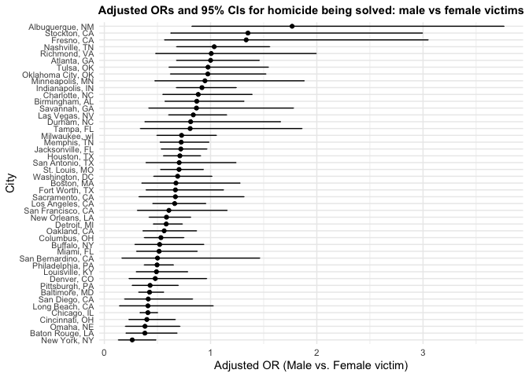
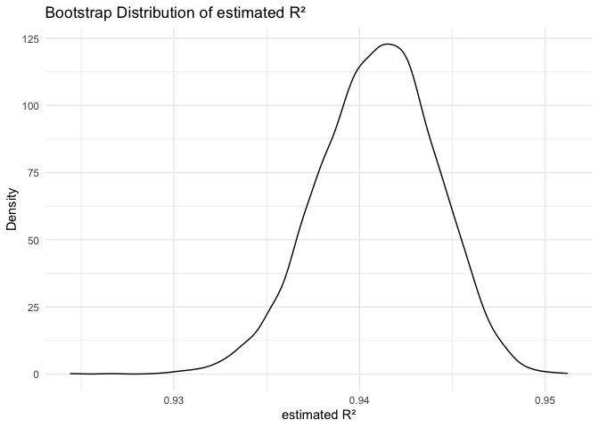
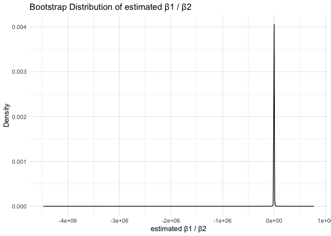
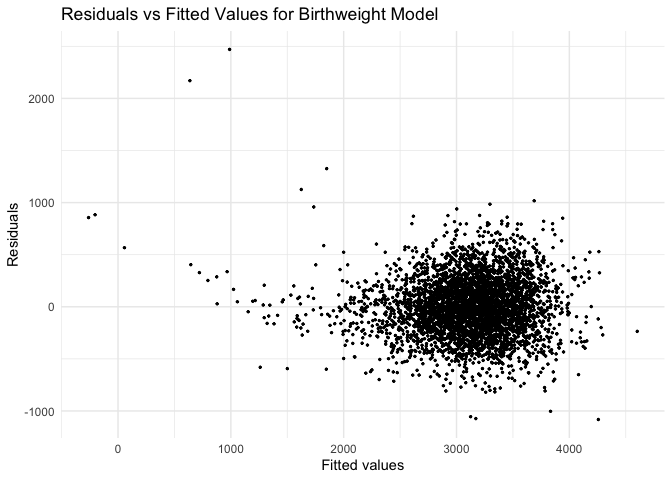

p8105_hw6_ym3077
================

``` r
library(tidyverse)
```

    ## ── Attaching core tidyverse packages ──────────────────────── tidyverse 2.0.0 ──
    ## ✔ dplyr     1.1.4     ✔ readr     2.1.5
    ## ✔ forcats   1.0.0     ✔ stringr   1.5.1
    ## ✔ ggplot2   3.5.2     ✔ tibble    3.3.0
    ## ✔ lubridate 1.9.4     ✔ tidyr     1.3.1
    ## ✔ purrr     1.1.0     
    ## ── Conflicts ────────────────────────────────────────── tidyverse_conflicts() ──
    ## ✖ dplyr::filter() masks stats::filter()
    ## ✖ dplyr::lag()    masks stats::lag()
    ## ℹ Use the conflicted package (<http://conflicted.r-lib.org/>) to force all conflicts to become errors

``` r
library(broom)
library(modelr)
```

    ## 
    ## Attaching package: 'modelr'
    ## 
    ## The following object is masked from 'package:broom':
    ## 
    ##     bootstrap

``` r
library(mgcv)
```

    ## Loading required package: nlme
    ## 
    ## Attaching package: 'nlme'
    ## 
    ## The following object is masked from 'package:dplyr':
    ## 
    ##     collapse
    ## 
    ## This is mgcv 1.9-3. For overview type 'help("mgcv-package")'.

``` r
library(ggplot2)
library(p8105.datasets)
```

## Problem 1

Import the dataset.

``` r
homicides_raw = 
  read_csv("https://raw.githubusercontent.com/washingtonpost/data-homicides/refs/heads/master/homicide-data.csv")
```

    ## Rows: 52179 Columns: 12
    ## ── Column specification ────────────────────────────────────────────────────────
    ## Delimiter: ","
    ## chr (9): uid, victim_last, victim_first, victim_race, victim_age, victim_sex...
    ## dbl (3): reported_date, lat, lon
    ## 
    ## ℹ Use `spec()` to retrieve the full column specification for this data.
    ## ℹ Specify the column types or set `show_col_types = FALSE` to quiet this message.

Create a city_state variable (e.g. “Baltimore, MD”), and a binary
variable indicating whether the homicide is solved. Omit cities Dallas,
TX; Phoenix, AZ; and Kansas City, MO – these don’t report victim race.
Also omit Tulsa, AL – this is a data entry mistake. For this problem,
limit your analysis those for whom victim_race is white or black. Be
sure that victim_age is numeric.

``` r
homicides_df = homicides_raw |>
  mutate(
    city_state = str_c(city, ", ", state),
    solved = as.numeric(disposition == "Closed by arrest"),
    victim_age = as.numeric(victim_age)
    ) |>
  filter(
    !(city_state %in% c("Dallas, TX", "Phoenix, AZ", "Kansas City, MO", "Tulsa, AL")),
    victim_race %in% c("White", "Black")
  )
```

    ## Warning: There was 1 warning in `mutate()`.
    ## ℹ In argument: `victim_age = as.numeric(victim_age)`.
    ## Caused by warning:
    ## ! NAs introduced by coercion

For the city of Baltimore, MD, use the glm function to fit a logistic
regression with resolved vs unresolved as the outcome and victim age,
sex and race as predictors.  
Save the output of glm as an R object; apply the broom::tidy to this
object; and obtain the estimate and confidence interval of the adjusted
odds ratio for solving homicides comparing male victims to female
victims keeping all other variables fixed.

``` r
baltimore_glm = homicides_df |>
  filter(city_state == "Baltimore, MD") |>
  glm(solved ~ victim_age + victim_race + victim_sex,
      data = _, 
      family = binomial())

baltimore_tidy = tidy(baltimore_glm, conf.int = TRUE) |>
  mutate(OR = exp(estimate),
         OR_low = exp(conf.low),
         OR_high = exp(conf.high))

baltimore_sexOR = baltimore_tidy |>
  filter(term == "victim_sexMale") |>
  select(term, OR, OR_low, OR_high) |>
  knitr::kable(digits = 3)
baltimore_sexOR
```

| term           |    OR | OR_low | OR_high |
|:---------------|------:|-------:|--------:|
| victim_sexMale | 0.426 |  0.324 |   0.558 |

In Baltimore, after adjusting for victim age and race, the estimated
odds of solved homicide are substantially lower for male victims
compared with female victims. The adjusted odds ratio is 0.426 (95% CI:
0.324–0.558), indicating that homicides involving male victims have
approximately 57% lower odds of being resolved. Because the confidence
interval does not include 1, this association is statistically
significant.

Now run `glm` for each of the cities in your dataset, and extract the
adjusted odds ratio (and CI) for solving homicides comparing male
victims to female victims. Do this within a “tidy” pipeline, making use
of `purrr::map`, list columns, and `unnest` as necessary to create a
dataframe with estimated ORs and CIs for each city.

``` r
city_OR = homicides_df |>
  nest(data = -city_state) |>
  mutate(
    model = map(data, \(df)
                glm(solved ~ victim_age + victim_race + victim_sex, 
                    data = df, family = binomial())),
    tidy_result = map(model, \(mod) tidy(mod, conf.int = TRUE) |>
                        mutate(
                          OR = exp(estimate),
                          OR_low = exp(conf.low),
                          OR_high = exp(conf.high))
                        )) |>
  select(city_state, tidy_result) |>
  unnest(tidy_result) |>
  filter(term == "victim_sexMale") |>
  select(city_state, OR, OR_low, OR_high)
```

    ## Warning: There were 43 warnings in `mutate()`.
    ## The first warning was:
    ## ℹ In argument: `tidy_result = map(...)`.
    ## Caused by warning:
    ## ! glm.fit: fitted probabilities numerically 0 or 1 occurred
    ## ℹ Run `dplyr::last_dplyr_warnings()` to see the 42 remaining warnings.

``` r
knitr::kable(city_OR, digits = 3)
```

| city_state         |    OR | OR_low | OR_high |
|:-------------------|------:|-------:|--------:|
| Albuquerque, NM    | 1.767 |  0.825 |   3.762 |
| Atlanta, GA        | 1.000 |  0.680 |   1.458 |
| Baltimore, MD      | 0.426 |  0.324 |   0.558 |
| Baton Rouge, LA    | 0.381 |  0.204 |   0.684 |
| Birmingham, AL     | 0.870 |  0.571 |   1.314 |
| Boston, MA         | 0.674 |  0.353 |   1.277 |
| Buffalo, NY        | 0.521 |  0.288 |   0.936 |
| Charlotte, NC      | 0.884 |  0.551 |   1.391 |
| Chicago, IL        | 0.410 |  0.336 |   0.501 |
| Cincinnati, OH     | 0.400 |  0.231 |   0.667 |
| Columbus, OH       | 0.532 |  0.377 |   0.748 |
| Denver, CO         | 0.479 |  0.233 |   0.962 |
| Detroit, MI        | 0.582 |  0.462 |   0.734 |
| Durham, NC         | 0.812 |  0.382 |   1.658 |
| Fort Worth, TX     | 0.669 |  0.394 |   1.121 |
| Fresno, CA         | 1.335 |  0.567 |   3.048 |
| Houston, TX        | 0.711 |  0.557 |   0.906 |
| Indianapolis, IN   | 0.919 |  0.678 |   1.241 |
| Jacksonville, FL   | 0.720 |  0.536 |   0.965 |
| Las Vegas, NV      | 0.837 |  0.606 |   1.151 |
| Long Beach, CA     | 0.410 |  0.143 |   1.024 |
| Los Angeles, CA    | 0.662 |  0.457 |   0.954 |
| Louisville, KY     | 0.491 |  0.301 |   0.784 |
| Memphis, TN        | 0.723 |  0.526 |   0.984 |
| Miami, FL          | 0.515 |  0.304 |   0.873 |
| Milwaukee, wI      | 0.727 |  0.495 |   1.054 |
| Minneapolis, MN    | 0.947 |  0.476 |   1.881 |
| Nashville, TN      | 1.034 |  0.681 |   1.556 |
| New Orleans, LA    | 0.585 |  0.422 |   0.812 |
| New York, NY       | 0.262 |  0.133 |   0.485 |
| Oakland, CA        | 0.563 |  0.364 |   0.867 |
| Oklahoma City, OK  | 0.974 |  0.623 |   1.520 |
| Omaha, NE          | 0.382 |  0.199 |   0.711 |
| Philadelphia, PA   | 0.496 |  0.376 |   0.650 |
| Pittsburgh, PA     | 0.431 |  0.263 |   0.696 |
| Richmond, VA       | 1.006 |  0.483 |   1.994 |
| San Antonio, TX    | 0.705 |  0.393 |   1.238 |
| Sacramento, CA     | 0.669 |  0.326 |   1.314 |
| Savannah, GA       | 0.867 |  0.419 |   1.780 |
| San Bernardino, CA | 0.500 |  0.166 |   1.462 |
| San Diego, CA      | 0.413 |  0.191 |   0.830 |
| San Francisco, CA  | 0.608 |  0.312 |   1.155 |
| St. Louis, MO      | 0.703 |  0.530 |   0.932 |
| Stockton, CA       | 1.352 |  0.626 |   2.994 |
| Tampa, FL          | 0.808 |  0.340 |   1.860 |
| Tulsa, OK          | 0.976 |  0.609 |   1.544 |
| Washington, DC     | 0.690 |  0.465 |   1.012 |

Create a plot that shows the estimated ORs and CIs for each city.
Organize cities according to estimated OR, and comment on the plot.

``` r
city_OR_plot = city_OR |>
  mutate(
    city_state = fct_reorder(city_state, OR)) |>
  ggplot(aes(x = city_state, y = OR)) + 
  geom_point() +
  geom_errorbar(aes(ymin = OR_low, ymax = OR_high), width = 0.1) +
  coord_flip() +
  labs(
    x = "City", 
    y = "Adjusted OR (Male vs. Female victim)",
    title = "Adjusted ORs and 95% CIs for homicide being solved: male vs female victims"
  ) +
  theme_minimal() +
  theme(
    axis.text.y = element_text(size = 8), 
    plot.title = element_text(face = "bold", size = 11, hjust = 0.5)   
  )
city_OR_plot
```

<!-- --> The
plot shows variation across cities in the adjusted odds ratio (OR)
comparing the probability that male versus female homicide victims have
their cases solved, after controlling for victim age and race. In
general, Male homicide victims are less likely to have their cases
solved than female victims (OR less than 1) in most cities, even after
accounting for age and race. A few cities deviate from this pattern, but
uncertainty is high in many of those cases.

## Problem 2

Use 5000 bootstrap samples and, for each bootstrap sample, produce
estimates of these two quantities.

``` r
data("weather_df")
set.seed(1)
```

``` r
weather_boot <- 
  weather_df |> 
  drop_na(tmax, tmin, prcp) |>
  modelr::bootstrap(n = 5000) |>
  mutate(
    fit = map(strap, ~ lm(tmax ~ tmin + prcp, data = .x)),
    r2 = map_dbl(fit, ~ broom::glance(.x)$r.squared),
    beta_ratio = map_dbl(fit, ~ {
      coefs <- broom::tidy(.x)
      beta1 <- coefs |> filter(term == "tmin") |> pull(estimate)
      beta2 <- coefs |> filter(term == "prcp") |> pull(estimate)
      beta1 / beta2
    })
  ) |>
  select(-strap, -fit)
```

Plot the distribution of your estimates, and describe these in words.

``` r
r2plot = weather_boot |>
  ggplot(aes(x = r2)) +
  geom_density() +
  labs(
    title = "Bootstrap Distribution of estimated R²",
    x = "estimated R²",
    y = "Density"
  ) +
  theme_minimal()
r2plot
```

<!-- --> The
bootstrap distribution of R² is approximately symmetric, indicating
across all repeated samples, the linear model `tmax ~ tmin + prcp`
consistently explains the majority of the variability; `tmin` and `prcp`
together provides a reliable prediction of `tmax`.

``` r
ratioplot = weather_boot |>
  ggplot(aes(x = beta_ratio)) +
  geom_density() +
  labs(
    title = "Bootstrap Distribution of estimated β1 / β2",
    x = "estimated β1 / β2",
    y = "Density"
    ) +
  theme_minimal()
ratioplot
```

<!-- -->
The bootstrap distribution of estimated β1 / β2 (ratio of the
coefficient on tmin to the coefficient on prcp) is left-skewed, ranging
from -400 to -100; suggesting large sampling variability in the ratio of
coefficients. This is expected as ratios of cofficients are often
unstable especially when one coefficient is near zero.

Using the 5000 bootstrap estimates, identify the 2.5% and 97.5%
quantiles to provide a 95% confidence interval for r² and β1 / β2 ratio

``` r
weather_boot |>
  summarize(
    r2CI_low = quantile(r2, 0.025),
    r2CI_high = quantile(r2, 0.975),
    ratioCI_low = quantile(beta_ratio, 0.025),
    ratioCI_high = quantile(beta_ratio, 0.975)
  )
```

    ## # A tibble: 1 × 4
    ##   r2CI_low r2CI_high ratioCI_low ratioCI_high
    ##      <dbl>     <dbl>       <dbl>        <dbl>
    ## 1    0.934     0.947       -275.        -125.

Using 5000 bootstrap samples, the 95% confidence interval for r² is
approximately: (0.935, 0.947), the 95% confidence interval for the ratio
of regression coefficients β1 and β2 is: (-278, -126).

## Problem 3

Load and clean the data for regression analysis (i.e. use appropriate
variable names, convert numeric to factor where appropriate, check for
the presence of missing data, etc.).

``` r
birthweight = read_csv("data/birthweight.csv") |>
  mutate(
    babysex = factor(babysex, 
                     levels = c(1,2), labels = c("male", "female")),
    frace = factor(frace, 
                   levels = c(1,2,3,4,8,9), 
                   labels = c("White", "Black", "Asian", "Puerto Rican", "Other", "Unknown")),
    mrace = factor(mrace, 
                   levels = c(1,2,3,4,8), 
                   labels = c("White", "Black", "Asian", "Puerto Rican", "Other")),
    malform = factor(malform, 
                     levels = c(0,1),
                     labels = c("absent", "present"))
  ) |>
  drop_na()
```

    ## Rows: 4342 Columns: 20
    ## ── Column specification ────────────────────────────────────────────────────────
    ## Delimiter: ","
    ## dbl (20): babysex, bhead, blength, bwt, delwt, fincome, frace, gaweeks, malf...
    ## 
    ## ℹ Use `spec()` to retrieve the full column specification for this data.
    ## ℹ Specify the column types or set `show_col_types = FALSE` to quiet this message.

``` r
birthweight
```

    ## # A tibble: 4,342 × 20
    ##    babysex bhead blength   bwt delwt fincome frace gaweeks malform menarche
    ##    <fct>   <dbl>   <dbl> <dbl> <dbl>   <dbl> <fct>   <dbl> <fct>      <dbl>
    ##  1 female     34      51  3629   177      35 White    39.9 absent        13
    ##  2 male       34      48  3062   156      65 Black    25.9 absent        14
    ##  3 female     36      50  3345   148      85 White    39.9 absent        12
    ##  4 male       34      52  3062   157      55 White    40   absent        14
    ##  5 female     34      52  3374   156       5 White    41.6 absent        13
    ##  6 male       33      52  3374   129      55 White    40.7 absent        12
    ##  7 female     33      46  2523   126      96 Black    40.3 absent        14
    ##  8 female     33      49  2778   140       5 White    37.4 absent        12
    ##  9 male       36      52  3515   146      85 White    40.3 absent        11
    ## 10 male       33      50  3459   169      75 Black    40.7 absent        12
    ## # ℹ 4,332 more rows
    ## # ℹ 10 more variables: mheight <dbl>, momage <dbl>, mrace <fct>, parity <dbl>,
    ## #   pnumlbw <dbl>, pnumsga <dbl>, ppbmi <dbl>, ppwt <dbl>, smoken <dbl>,
    ## #   wtgain <dbl>

Propose a regression model for birthweight. This model may be based on a
hypothesized structure for the factors that underly birthweight, on a
data-driven model-building process, or a combination of the two.
Describe your modeling process

``` r
bw_mod = lm(bwt ~ blength + bhead + gaweeks + momage + 
              smoken + ppbmi + ppwt + wtgain, data = birthweight)
summary(bw_mod)
```

    ## 
    ## Call:
    ## lm(formula = bwt ~ blength + bhead + gaweeks + momage + smoken + 
    ##     ppbmi + ppwt + wtgain, data = birthweight)
    ## 
    ## Residuals:
    ##      Min       1Q   Median       3Q      Max 
    ## -1082.04  -185.63    -7.45   174.72  2470.19 
    ## 
    ## Coefficients:
    ##               Estimate Std. Error t value Pr(>|t|)    
    ## (Intercept) -6092.7255    98.2399 -62.019  < 2e-16 ***
    ## blength        77.3094     2.0632  37.471  < 2e-16 ***
    ## bhead         133.6920     3.4750  38.473  < 2e-16 ***
    ## gaweeks        13.4173     1.4868   9.024  < 2e-16 ***
    ## momage          6.3282     1.1237   5.632 1.90e-08 ***
    ## smoken         -2.7099     0.5795  -4.676 3.01e-06 ***
    ## ppbmi         -12.8500     2.5862  -4.969 7.00e-07 ***
    ## ppwt            3.2810     0.4127   7.950 2.36e-15 ***
    ## wtgain          3.9797     0.4039   9.852  < 2e-16 ***
    ## ---
    ## Signif. codes:  0 '***' 0.001 '**' 0.01 '*' 0.05 '.' 0.1 ' ' 1
    ## 
    ## Residual standard error: 279.7 on 4333 degrees of freedom
    ## Multiple R-squared:  0.7024, Adjusted R-squared:  0.7018 
    ## F-statistic:  1278 on 8 and 4333 DF,  p-value: < 2.2e-16

Birthweight can be determined by fetal size, gestational development,
and maternal health beahviors and characteristics. Based on that I
followed a hypothesis-driven modeling appproach focusing on relevant
predictors: - fetal size indicators: `blength` (baby’s length at birth)
and `bhead` (baby’s head circumference at birth); - gestational
development: `gaweeks` (gestational age in weeks); - maternal
characteristics and behavior indicators: `momage` (mother’s age at
delivery), `smoken` (average number of cigarettes smoked per day during
pregnancy), `ppbmi` (mother’s pre-pregnancy BMI), `ppwt` (mother’s
pre-pregnancy weight), `wtgain` (mother’s weight gain during pregnancy)

``` r
birthweight |>
  add_predictions(bw_mod) |>
  add_residuals(bw_mod) |>
  ggplot(aes(x = pred, y = resid)) +
  geom_point(size = 0.5) +
  labs(
    x = "Fitted values",
    y = "Residuals",
    title = "Residuals vs Fitted Values for Birthweight Model"
  ) +
  theme_minimal()
```

<!-- -->
This plot shows no strong nonlinear pattern between residuals and fitted
values, suggesting the linear model is mostly appropriate. There is mild
heteroscedasticity with larger residuals spread at higher fitted values.
There is some outliers but most residuals cluster around zero without
obvious structure. Overall, the model is reasonable though variance is
not perfectly constant across fitted values.

Compare your model to two others:  
- One using length at birth and gestational age as predictors (main
effects only)  
- One using head circumference, length, sex, and all interactions
(including the three-way interaction) between these

``` r
bw_mod = lm(bwt ~ blength + bhead + gaweeks + momage + 
              smoken + ppbmi + ppwt + wtgain, data = birthweight)

main_mod = lm(bwt ~ blength + gaweeks, data = birthweight)

int_mod = lm(bwt ~ bhead * blength * babysex, data = birthweight)
```

Make this comparison in terms of the cross-validated prediction error;
use `crossv_mc` and functions in `purrr` as appropriate.

``` r
cv_bw = 
  crossv_mc(birthweight, n = 100) |>
  mutate(
    train = map(train, as_tibble),
    test = map(test, as_tibble),
    
    fit_bw = map(train, \(df) lm(bwt ~ blength + bhead + gaweeks + momage + 
              smoken + ppbmi + ppwt + wtgain, data = df)),
    fit_main = map(train, \(df) lm(bwt ~ blength + gaweeks, data = df)),
    fit_int = map(train, \(df) lm(bwt ~ bhead * blength * babysex, data = df)), 
    
    rmse_bw = map2_dbl(fit_bw, test, \(mod, df) rmse(model = mod, data = df)),
    rmse_main = map2_dbl(fit_main, test, \(mod, df) rmse(model = mod, data = df)),
    rmse_int = map2_dbl(fit_int, test, \(mod, df) rmse(model = mod, data = df))
  )

cv_result = cv_bw |>
  select(starts_with("rmse")) |>
  summarize(
    rmse_bw = mean(rmse_bw),
    rmse_main = mean(rmse_main),
    rmse_int = mean(rmse_int)
  )
cv_result
```

    ## # A tibble: 1 × 3
    ##   rmse_bw rmse_main rmse_int
    ##     <dbl>     <dbl>    <dbl>
    ## 1    280.      333.     289.
